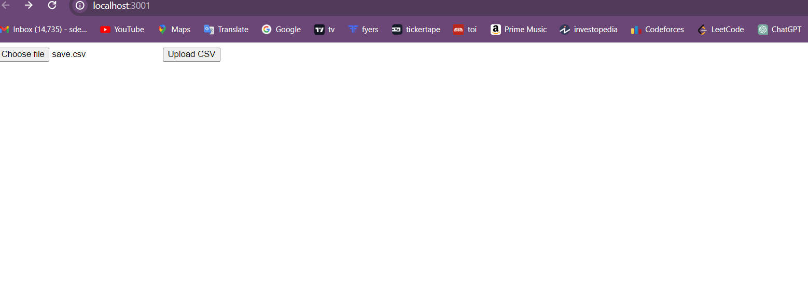
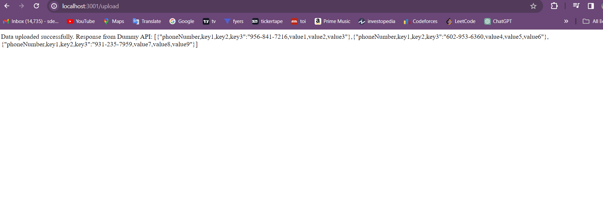

#Backend Project

## Images




<hr/>

This is a [node.js](https://nodejs.org/) project.

The easiest way to get started is to clone the repository:
```bash
# Get the latest snapshot
git clone https://github.com/ack13/project_dummyApi.git

# Install NPM dependencies
npm install

# Then simply start your app
npm start
```


### How to Use:

1. Run readCsv.js & dummy-api.js
2. Open [http://localhost:3001] with your browser to see the result.
3. Select a file from your device.
4. Upload the file.
5. You will get a response showing the csv file contents.


